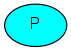

### 简介

RabbitMQ是一个消息代理：它接收和传递消息。你可以认为它是一个邮局：当你把发送的信件放在一个信箱，快递员最终会把它送到收信人手上。在上述比喻中，RabbitMQ就是信箱、邮局和快递员。

RabbitMQ和邮局最大的不同是：它接收、存储和传递二进制数据——消息，而不是信件。

总体来说，RabbitMQ和消息发送都会使用一些专业术语。

生产者生产指仅仅发送消息。一段发送消息的程序就是一个生产者。

    
队列：队列就像是RabbitMQ里头的邮箱。虽然消息在RabbitMQ和你的应用之间传递，但是它只在队列里面存储。队列大小受由主机内存空间和硬盘空间约束。

    
消费者：消费和接收消息的意思一样。消费者是指接收消息的程序。

    
注意：生产者、消费者和代理不必部署在同一台主机；相反大部分场景下它们根本就不会部署在一台主机。

### "Hello World"

在这一章里我们用PHP来写两段程序；一个生产者发送一条消息，一个消费者接收消息并输出打印。我们要忽略php-amqplib API中的一些细节，集中注意力在简单的场景来展开编码——编写一段"Hello World"的代码。

在如下图中，'P'就是生产者，'C'就是消费者。中间的就是队列，它在消费者前面，RabbitMQ用它来保存消息缓冲。

    php-amqplib库：
    RabbitMQ支持多种协议。本文档用AMQP 0-9-1协议，它是一个开源的通用消息传送协议。许多语言都有amqplib库。本文档用php-amqplib库来写代码，用Composer来做依赖管理。
    
在你的项目目录下加上composer.json文件：

	{
	    "require": {
	        "php-amqplib/php-amqplib": ">=2.6.1"
	    }
	}

然后执行以下命令：

	composer install

现在已经安装好了php-amqplib库，开始写代码。

### sending

把消息发布者命名为send.php文件，消息接受者命名为receive.php。发布者会连接RabbitMQ，发送一条消息，然后退出。

在send.php，我们要加载php-amqplib库和use相应的类：

	require_once __DIR__ . '/vendor/autoload.php';
	use PhpAmqpLib\Connection\AMQPStreamConnection;
	use PhpAmqpLib\Message\AMQPMessage;

然后连接到服务端：

	$connection = new AMQPStreamConnection('localhost', 5672, 'guest', 'guest');
	$channel = $connection->channel();

这个连接是socket连接的一个抽象，要注意协议版本、身份认证等等。这里我们连接到了本机的RabbitMQ——就是localhost啦。如果我们想连接到其它主机的RabbitMQ，那么就修改一下IP地址就可以了。

然后就创建一个channel，大部分的API调用就在这里。

为了发送消息，我们必须声明一个队列，然后发布消息到队列中：

	$channel->queue_declare('hello', false, false, false, false);
	
	$msg = new AMQPMessage('Hello World!');
	$channel->basic_publish($msg, '', 'hello');
	
	echo " [x] Sent 'Hello World!'\n";

声明队列属于幂等操作，不存在这个队列才会声明。消息内容是数组格式，你可以对它进行encode。

最后要关闭channel和connection。

	$channel->close();
	$connection->close();

### Receiving

RabbitMQ会推送消息给接收者，因此不像发布者只发布一条消息就退出，我们要让接收者一直监听消息和输出打印。

receive.php的加载和use方式几乎和send.php一样：

	require_once __DIR__ . '/vendor/autoload.php';
	use PhpAmqpLib\Connection\AMQPStreamConnection;

设置参数和发布者一样。我们打开一个连接和一个channel，然后声明一个队列，我们要获取这个队列的消息。注意这个设置要和send的设置一致。

	$connection = new AMQPStreamConnection('localhost', 5672, 'guest', 'guest');
	$channel = $connection->channel();
	
	$channel->queue_declare('hello', false, false, false, false);
	
	echo ' [*] Waiting for messages. To exit press CTRL+C', "\n";

我们这里也声明了一个队列。因为我们有可能会在发布消息前进行订阅消费，所以在获取消息之前我们要确认队列是存在的。

我们要告诉服务端从队列中推送消息给我们。因此我们要定义一个php回调来接收服务端的推送消息。记住，服务端向客户端发送消息是异步发送的。

	$callback = function($msg) {
	  echo " [x] Received ", $msg->body, "\n";
	};
	
	$channel->basic_consume('hello', '', false, true, false, false, $callback);
	
	while(count($channel->callbacks)) {
	    $channel->wait();
	}

这样代码就会阻塞直到channel有回调。回调函数使得我们可以随时接收消息。

    列出队列：
        你也许想知道RabbitMQ有什么队列。这时可以利用rabbitmqctl工具来查看:
        
        Linux：sudo rabbitmqctl list_queues
        Windows：rabbitmqctl.bat list_queues